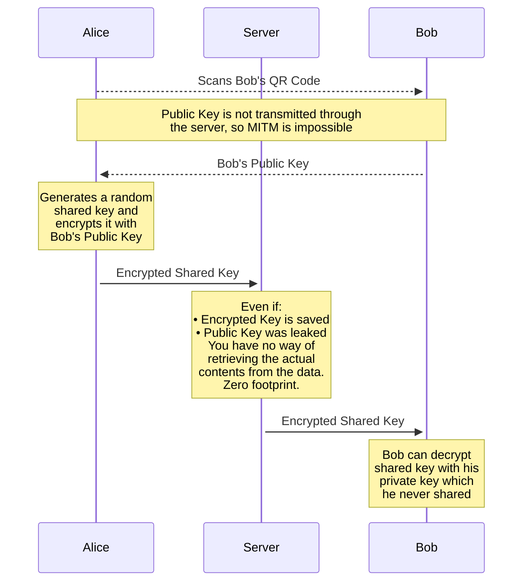

# Key Exchange (kex)

Kex algorithm is intended to provide a secure way to share your key P2P
with the use of side channel to make sure that no info is accessible by server.

## Comparison with Offline Sharing

Before this protocol we used to share keys as a plain text in a QR code 
without any Internet requests that way it can't be physically accessed by the
server.

This solution is pretty straightforward, and the only downside it has
is digital footprint: once the image of a QR code has been leaked, you can do
little to nothing to guarantee that no one can access your chat.

## No Digital Footprint

So, our goal is to make it impossible to use any given QR Code multiple times
yet make it impossible for server to access the key itself.

## Simplified Idea

Basically, what we want to do is to share some single-time public key which
is no problem too leak in the future. This public key will be used to encrypt
information, but you won't be able to decrypt any info with that. Having such
key we can derive completely secret key for anyone but two devices:



## Technical Implementation

On of the best ways to stay secure – not to reinvent the weel. That's why we are
using modern encryption standards intead of coming with our own solutions.

Below is the implementation written in pseudocode that hopefully everyone should
understand.

**Link format**: `seed://kex-share?queueId=XXXXXX&url=XXXXXX&publicKey=XXXXXX`

Alice (**Sharing Side**) implementation:

```go
// This is the key we want Bob to know (secretly)
var sharedKey base64 = "XXXXXX"

// Classic RSA stuff
var (
  publicKey base64
  privateKey base64
) = randomRSAKeyPair()

// Select a random queue to perform exchange in
var queueId base64 = random256Bits()

// Bob will eventually scan this
showExportQR(publicKey, queueId)

var queue = subscribe(queueId)

// Waiting for message from Bob
var requestEncrypted base64 = queue.next()
// Bob encrypted message with public key,
// so we can decode it with our private key
var requestJson json = decryptRSA(requestEncrypted, privateKey)
// Bob sent his public key, so we
// can encrypt shared key with it
var request struct {
  publicKey base64
} = decodeJson(welcome)

// Prepare response for Bob
var response = {
  sharedKey: sharedKey
}
// Json, again
var responseJson = encodeJson(response)
// Now using public key provided by Bob to encrypt sharedKey
var responseEncrypted = encryptRSA(responseJson, request.publicKey)

send(queueId, responseEncrypted)
```

Bob (**Claiming Side**) implementation:

```go
// Alice provides queueId and public key 
// for us via QR Code
var inital struct {
  queueId base64
  publicKey base64
} = scanQRCode()

// Prepare the pair that Alice will use
// to send shared key
var (
  publicKey base64
  privateKey bse64
) = randomRSAKeyPair()

var request = {
  publicKey: publicKey
}
var requestJson = encodeJson(request)
// We use key provided by Alice for encryption
var requestEncrypted = encryptRSA(requestJson, initial.publicKey)
send(queueId, requestEncrypted)

var queue = subscribe(queueId)

var responseEncrypted = queue.next()
// Alice encrypted message using our key
var responseJson = decryptRSA(responseEncrypted, privateKey)
var respone struct {
  sharedKey base64
} = decodeJson(responseJson)
```

